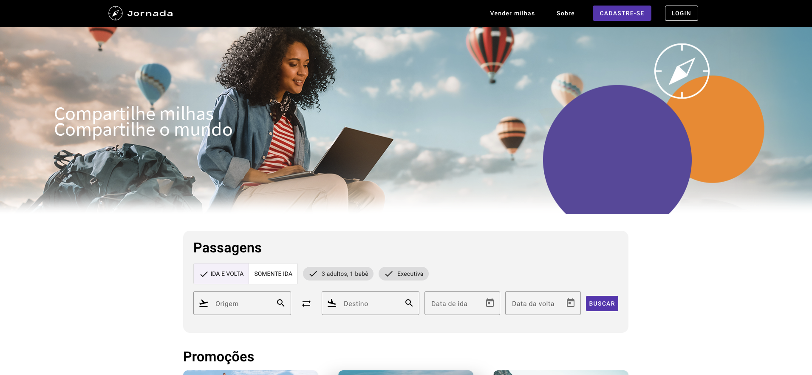

# Jornada Milhas

O Jornada Milhas é uma StartUP. 
Nesse momento, é um MVP que tá só começando e ainda tem muitas funcionalidades novas para serem desenvolvidas.

## 🔨 Funcionalidades do projeto

O [Figma dessa aplicação você encontra aqui](https://www.figma.com/file/SI696t31Q9zlsXKttCoqKP/Angular%3A-Componentização-e-Design-com-Angular-Material-%7C-Jornada-Milhas?type=design&node-id=4-6408&mode=design&t=mmbAh5QEafSRIGqQ-0).

## ✔️ Técnicas e tecnologias utilizadas

Se liga nessa lista de tudo que usaremos nesse curso:

- `Angular`
- `Angular CLI`
- `Angular Material`
- `Figma`

E muito mais!

## 🛠️ Abrir e rodar o projeto

Para abrir e rodar o projeto, execute `npm i` para instalar as dependências e `ng serve` para iniciar o projeto.

Depois, acesse <a href="http://localhost:4200/">http://localhost:4200/</a> no seu navegador.

