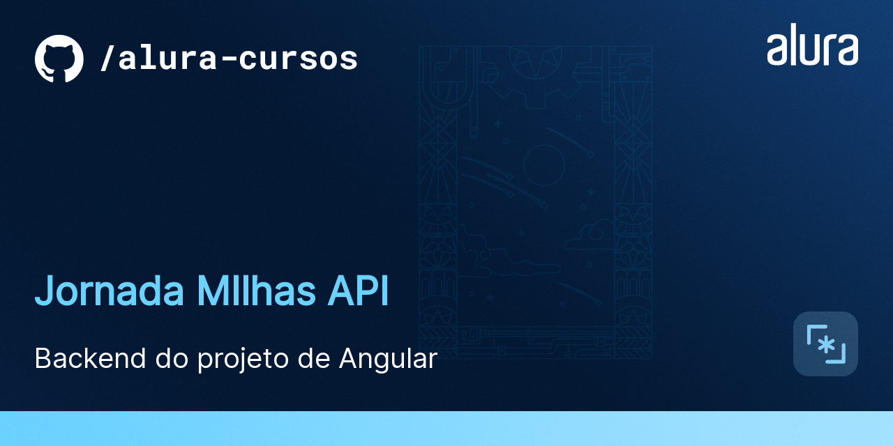
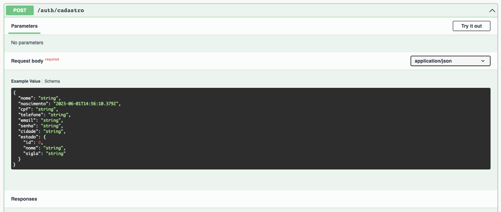
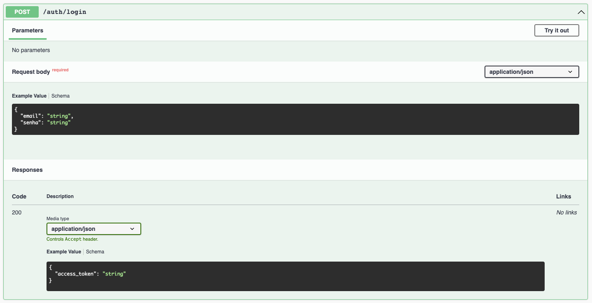

# Api em Nest

Esse é um protótipo da API pra permitir o desenvolvimento do frontend.


## 🛠️ Instalação

```bash
$ npm install
```

## 🛠️ Execução

Abra um terminal e execute o seguinte comando:

```bash
$ npm run start
```

## 🛠️ Documentação

Com a aplicação em execução, abra o seu navegador e acesse [http://localhost:8080/api](http://localhost:8080/api) para ter acesso ao Swagger, a fonte de verdade sobre a nossa API e como ela funciona:


## Autenticação

Você pode se cadastrar utilizando o endpoint:



E se autenticar utilizando o endpoint:



E depois, basta adicionar o token ao header das requisições autenticadas:

```
Authorization: Bearer <ACCESS_TOKEN>
```
